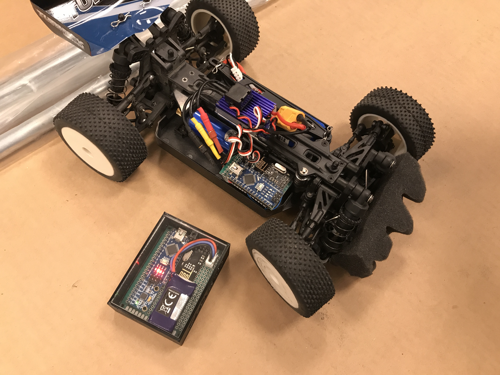
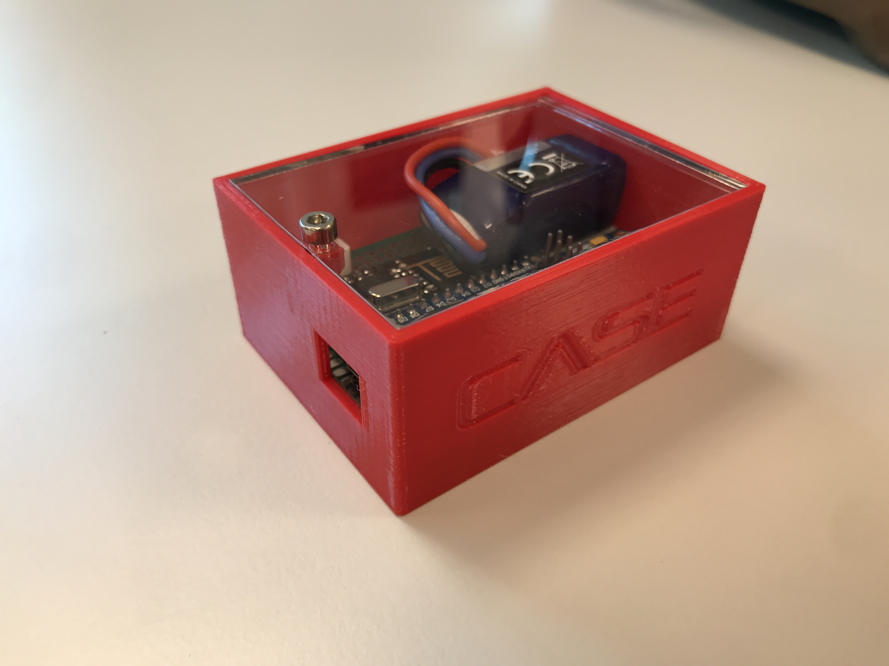
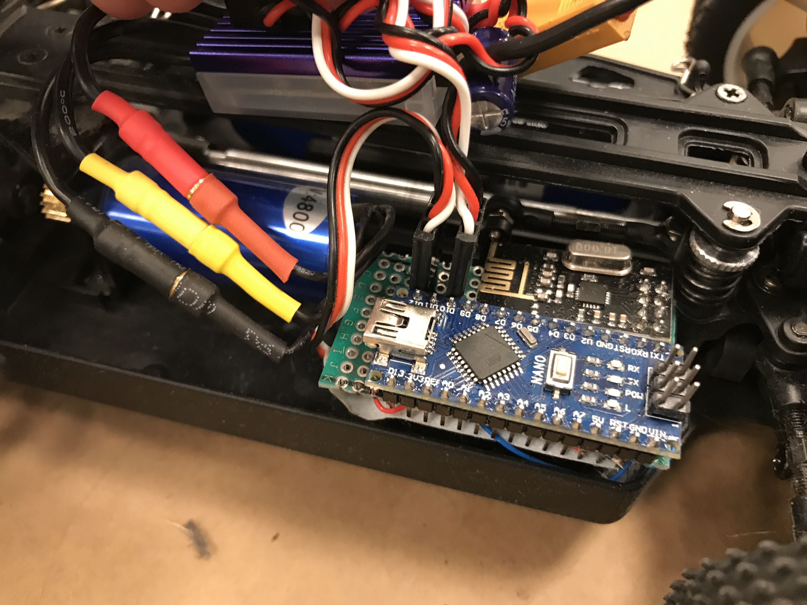
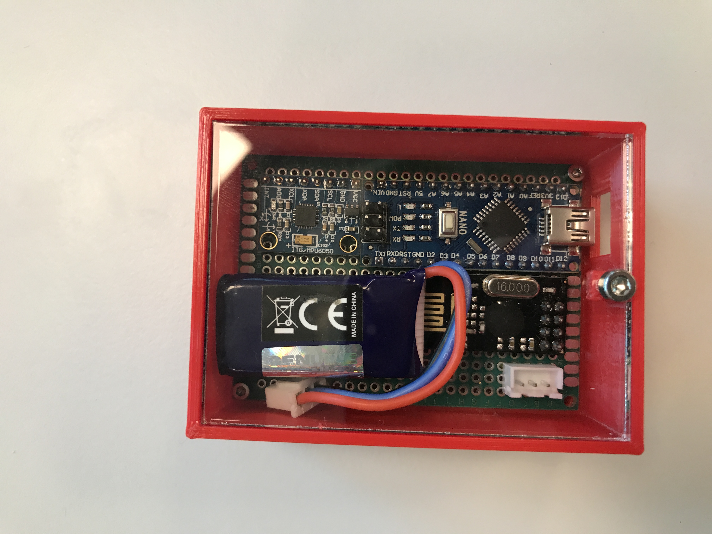
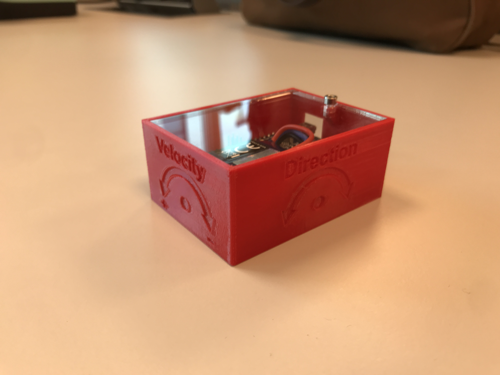

# CASE RC Car
Control a rc car wirelessly by tilting your hand!

## System overview
The system consist of 2 main parts, the RC car with a reciever module and a transmitter module.

The reciever module is an Arduino Nano, NRF24L01+ (wireless transceiver) and 2x3 pin headers on a perfboard. It connects to the ESC and Servo via the two pin headers. The ESC supplies 5V to the Arduino and the Servo. The Arduino supplies control signals to the ESC and the Servo.

The transmitter module consists of a Arduino nano, NRF24L01+, MPU6050 (IMU, accelerometer + gyroscope) a voltage regulator (buck) on a perfboard inside a 3D printed case with a acrylic panel on top. 

## How do you use it?
<b>Step 1</b>

Connect both ESC and Servo to the reciever perfboard on the rc car.
Connect a 2s LiPo battery to the rc car and power it on.
The car should beep a few times and then turn the wheels to a forward drive and stand still.

<b>Step 2</b>

Strap the transmitter box on top of your hand with the veclro strap.

Turn on transmitter by plugging in the battery in the JST connector.

Place your hand so that your palm faces, the MCU will start talking with the IMU, setting it up and calibrating.

After about 3s the system is ready and you can tilt your hand to control the car.

Tilt your hand forward to accelerate and backwards to decelerate. In order to reverse you have to go to normal position, backwards, then normal and then backwards again.

Tilt your hand to the right or left to turn. 

## How does it work?
We use the gravity vector on X and Y axis to determine how to accelerate/decelerate and turn.
Take a look at the code (it has alot of comments) if you are interested to see the inner workings. 

## Creating more
The files for the box and panel are in the hardware folder. (STL, STEP, F3D, DXF)

## Development
The plattformio project contains personal VS code tasks for uploading and monitoring both devices with a single button click. 
You will have to edit them for them to work on your system. 